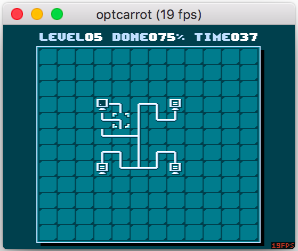

Today in little known Ruby trivia
=================================

These were surely inspired by sferik's Ruby Trivia:

* [Ruby Trivia 1](https://speakerdeck.com/sferik/ruby-trivia)
* [Ruby Trivia 2](https://speakerdeck.com/sferik/ruby-trivia-2)
* Still happy to [collaborate](https://twitter.com/sferik/status/662677213758824448) ^^


2016
====


October 14
----------

Shadow variables ([link](https://twitter.com/josh_cheek/status/786915998343503872))

```ruby
a = 1  # => 1

lambda { |;a| a = 2 }.call  # => 2
a                           # => 1

lambda { a = 2 }.call  # => 2
a                      # => 2
```


October 15
----------

Constants you're not supposed to know about. ([link](https://twitter.com/josh_cheek/status/787477591930376192)) ```ruby ObjectSpace.each_object(Module).select { |c| c.to_s[/(^|:)[a-z]/] } # => [Complex::compatible, #     Rational::compatible, #     NameError::message, #     fatal, #     IO::generic_writable, #     IO::generic_readable] ``` October 16 ---------- `NameError::message` hangs onto the receiver so it can calculate the message on demand. ([link](https://twitter.com/josh_cheek/status/787709475377602560)) ```ruby s = String.new
e = s.m rescue $!

def s.inspect() "s1" end
e.message  # => "undefined method `m' for s1:String"

def s.inspect() "s2" end
e.message  # => "undefined method `m' for s2:String"
```


October 17
----------

Core constants are accessed via inheritance, not lexical scope. ([link](https://twitter.com/josh_cheek/status/787905568841142272))

```ruby
class String
  Array       # => Array
end           # => Array

class BasicObject
  Array # ~> NameError: uninitialized constant BasicObject::Array\nDid you mean?  Array
end
```


October 18
----------

The "scope resolution operator" looks up methods as well as constants. ([link](https://twitter.com/josh_cheek/status/788356344000737280))

```ruby
Array::                   # => Array
  new(5) { |n| n * 2 }::  # => [0, 2, 4, 6, 8]
  reduce(0, :+)::         # => 20
  even?                   # => true

Array::new(5) { |n| n * 2 }::reduce(0, :+)::even?  # => true
```


October 19
----------

There are 6 ways to call a proc.
Explanation [here](6_ways_to_call_a_proc.md).
([link](https://twitter.com/josh_cheek/status/788801646553886720))


```ruby
prc = lambda { |n| n + 1 }

prc.call 2    # => 3
prc === 2     # => 3
prc.yield 2   # => 3
prc[2]        # => 3
prc.(2)       # => 3
prc::(2)      # => 3
```


October 20
----------

Global functions are private instance methods inherited from Kernel. Explanation [here](global_functions.md).
([link](https://twitter.com/josh_cheek/status/789230643087572994))

```ruby
# `puts` is a private method inherited from Kernel
self.method(:puts).owner # => Kernel
self.puts("a") rescue $! # => #<NoMethodError: private method `puts' called for main:Object\nDid you mean?  putc>
Kernel.module_eval { public :puts }
self.puts("b")

# Now it's public everywhere!
12345.puts("c")
"abc".puts("d")
Array.puts("e").puts("f")

# >> b
# >> c
# >> d
# >> e
# >> f
```


October 22
----------

Main is just an object with some methods defined on its singleton class.
Explanation [here](global_functions.md).
([link](https://twitter.com/josh_cheek/status/790096350306115584))

```ruby
self # => main

class << self
  remove_method :inspect
end

self       # => #<Object:0x007fa3810d6660>
Object.new # => #<Object:0x007fa3818891c8>
```


October 23
----------

Main's visibility starts off private, and methods defined there get added to Object.
([link](https://twitter.com/josh_cheek/status/790091502097604608))

```ruby
def x() 1 end
public
def y() 2 end

"abc".x rescue $!.message  # => "private method `x' called for \"abc\":String"
"abc".y                    # => 2
"abc".method(:x).owner     # => Object
```


October 26
----------

Local variables are known before they are used.
([link](https://twitter.com/josh_cheek/status/791361239666397184))

```ruby
a = 1                # => 1
local_variables      # => [:a, :b]

eval('a')            # => 1
eval('b')            # => nil
eval('c') rescue $!  # => #<NameError: undefined local variable or method `c' for main:Object>
b = 2                # => 2
```


October 27
----------

You can place ordinal-parameters before and after rest-parameters.
([link](https://twitter.com/josh_cheek/status/791790634151489536))

```ruby
def m(param1, *rest, param2)
  param1 # => 1
  rest   # => [2, 3, 4]
  param2 # => 5
end

m(1, 2, 3, 4, 5)
```


October 28
----------

Asperands are used to differentiate operators that go in the front vs the back
([link](https://twitter.com/josh_cheek/status/792028384393961473))

```ruby
class Symbol
  def -@(*) :front end
  def -(*)  :back  end
end

-:s      # => :front
:s - :t  # => :back

:s.-@    # => :front
:s.-     # => :back
```


October 29
----------

You don't need curly braces when interpolating
class variables, instance variables, or global variables
([link](https://twitter.com/josh_cheek/status/792454912386871297))

```ruby
a   = 1                # => 1
@@b = 2                # => 2
@c  = 3                # => 3
$d  = 4                # => 4
"-#{a}-#@@b-#@c-#$d-"  # => "-1-2-3-4-"
```


October 30
----------

Global variables can be aliased.
([link](https://twitter.com/josh_cheek/status/792642615967617025))

```ruby
alias $a $b

$b = 1
$a # => 1

$a = 2
$b # => 2
```


October 31
----------

There are 9 types of arguments.
([link](https://twitter.com/josh_cheek/status/793060811237367809))

```ruby
shadow = :outside
lambda { |
  ord1,          # ordinal (required) before restargs
  opt=:opt,      # optional ordinal (defaults if not set)
  *rest,         # rest args (aggregates ordinals into an array)
  ord2,          # ordinal after restargs
  kw:,           # keyword, required
  kwopt: :kwopt, # optional keyword (defaults if not set)
  **kwrest,      # keyword rest args (aggregates keywords into a hash)
  &block;        # wraps block in a proc and assigns to a varaible
  shadow         # declares a new variable, ignoring the outside one
| ord1           # => :ord1
  opt            # => :opt
  rest           # => []
  ord2           # => :ord2
  kw             # => :kw
  kwopt          # => :kwopt
  kwrest         # => {}
  block.call     # => :block
  shadow         # => nil
}.call(:ord1, :ord2, kw: :kw) { :block }
```


November 1
----------

You don't need brackets when assigning an array (there is an implicit array around multiple assignment).
([link](https://twitter.com/josh_cheek/status/793517994987098112))

```ruby
a = 1, 2, 3
a # => [1, 2, 3]
```


November 2
----------

Backticks are a method
([link](https://twitter.com/josh_cheek/status/793821846927998977))

```ruby
def `(str)
  str.reverse
end

`ls -l`  # => "l- sl"
```


November 3
----------

Every method can take a block.
Pretty sure it's stored [here](https://github.com/ruby/ruby/blob/trunk/vm_core.h#L636)
([link](https://twitter.com/josh_cheek/status/794181672526905346))

```ruby
# Some methods we call all the time
puts(1)    { 2 }  # => nil
Object.new { 3 }  # => #<Object:0x007fe2a2904098>
4.+(5)     { 6 }  # => 9

# Our own method
def omg() block_given? end  # => :omg
omg { 7 }                   # => true

def bbq() block_given? end  # => :bbq
bbq                         # => false

# >> 1
```


November 4
----------

Constant assignment is always based on lexical scope (the word "class" in the source code)
([link](https://twitter.com/josh_cheek/status/794585743259668483)).

```ruby
class A
end

class B
  ::A.module_eval   { C = :C }
  ::A.class_eval    { D = :D }
  ::A.instance_eval { E = :E }
  Class.new         { F = :F }
end

A.constants # => []
B.constants # => [:C, :D, :E, :F]
```


November 5
----------

Block scopes have a target class for the `def` keyword, the different types of eval modify this
([link](https://twitter.com/josh_cheek/status/794968385222217728)).

```ruby
C1 = Class.new  # => C1

class C2
  ::C1.module_eval   { def a() :a end } # C1
  ::C1.class_eval    { def b() :b end } # C1
  ::C1.instance_eval { def c() :c end } # C1's singleton class
  C3 = Class.new     { def d() :d end } # C2::C3
  lambda             { def e() :e end } # C2
end.call  # => :e

C1.new.a      # => :a
C1.new.b      # => :b
C1.c          # => :c
C2::C3.new.d  # => :d
C2.new.e      # => :e
```

The obvious thing to wonder, IMO, is what happens when you pass a method instead of a block.
As of 2.3.1, it does not change self (IIRC, it used to just explode in this situation).

```ruby
C1, C2 = Class.new, Class.new
def C1.omg(arg)
  self # => C1, C1, C1
  arg  # => C2, C2, C2
end
C2.module_eval   &C1.method(:omg)
C2.class_eval    &C1.method(:omg)
C2.instance_eval &C1.method(:omg)
```

And it does not change the deftarget (it's still Object).

```ruby
C, @count = Class.new, 0  # => [C, 0]

def self.omg(*)
  case @count += 1            # => 1, 2, 3, 4
  when 1 then def a() :a end  # => :a
  when 2 then def b() :b end  # => :b
  when 3 then def c() :c end  # => :c
  when 4 then def d() :d end  # => :d
  end                         # => :a, :b, :c, :d
end                           # => :omg

omg                            # => :a
C.module_eval   &method(:omg)  # => :b
C.class_eval    &method(:omg)  # => :c
C.instance_eval &method(:omg)  # => :d
Object.instance_methods false  # => [:b, :a, :d, :c]
```

November 6
----------

You can write code almost anywhere you like!
([link](https://twitter.com/josh_cheek/status/795280135163441152))

In this case, the namespace and superclass can be any code as long as it evaluates to a class.
The fork lets us see both branches of the if statement without changing code.

```ruby
class "In A #{class InANamespace; end} String!".class::AndAlso <
        if class InAConditional; end || fork # <-- lets us eval both branches of the if statement
          :"In A #{class AndInA; end} Symbol!".class
        else
          /In A #{class Superclass; end} Regex!/.class
        end
end
String::AndAlso.superclass # => Symbol, Regexp
```

November 7
----------

`not` is just syntactic sugar for `!@` ([link](https://twitter.com/josh_cheek/status/795778934965207040)).

```ruby
s = ""
def s.!@() "RAWR" end
!s     # => "RAWR"
not s  # => "RAWR"
```


November 9
----------

The `-e` flag lets you pass a program through ARGV instead of a filename containing a program
([link](https://twitter.com/josh_cheek/status/796497919474012160)).

```sh
$ ruby -e 'puts "hello, world"'
hello, world
```


November 10
-----------

The `-n` and `-p` flags iterate over every line of input, setting it to `$_`, `-p` prints `$_` out afterwards
([link](https://twitter.com/josh_cheek/status/796721958520033281)).

```sh
$ printf "abc\ndef\n" | ruby -n -e 'p $_'
"abc\n"
"def\n"

$ printf "abc\ndef\n" | ruby -p -e '$_ = $_.upcase'
ABC
DEF
```


November 11
-----------

When using `-n` or `-p`, the global variable `$.` contains the current input line number
([link](https://twitter.com/josh_cheek/status/797149586951405568)).

```sh
$ printf "abc\ndef\nghi\n"
abc
def
ghi

$ printf "abc\ndef\nghi\n" | ruby -p -e '$_ = "#{$.}\t#{$_}"'
1	abc
2	def
3	ghi
```

I suppose, to be fair, it's the current input line number regardless of whether you're using `-n` or `-p`,
that's the context you would use it in, but it doesn't depend on them.

```ruby
$stdin, $stdout = IO.pipe
puts "a\nb\nc"

$.   # => 0
gets # => "a\n"
$.   # => 1
gets # => "b\n"
$.   # => 2
```


November 12
-----------

The `-l` flag will automatically strip trailing newlines from input
([link](https://twitter.com/josh_cheek/status/797539812727201792)).

```sh
$ printf "abc\ndef\nghi\n" | ruby -ne 'puts "#{$_.inspect} #$_ #$."'
"abc\n" abc
 1
"def\n" def
 2
"ghi\n" ghi
 3

$ printf "abc\ndef\nghi\n" | ruby -l -ne 'puts "#{$_.inspect} #$_ #$."'
"abc" abc 1
"def" def 2
"ghi" ghi 3
```

Here is an example of where it is useful.

```sh
$ printf "abc\ndef\nghi\n" | ruby -lne 'puts "#$_ #$."'
abc 1
def 2
ghi 3

$ printf "abc\ndef\nghi\n" | ruby -ne 'puts "#$_ #$."'
abc
 1
def
 2
ghi
 3
```


November 13
-----------

The `-a` flag will split lines of input into an array stored in `$F`
([link](https://twitter.com/josh_cheek/status/797862561131724800)).

Here, we can see that `$F` is an array of the line being split (it is split by the input record separator, which is whitespace by default).

```sh
$ printf "a b c\nd e f\ng h i\n" | ruby -ane 'p $F'
["a", "b", "c"]
["d", "e", "f"]
["g", "h", "i"]

$ printf "a b c\nd e f\ng h i\n" | ruby -ane 'p $F'
["a", "b", "c"]
["d", "e", "f"]
["g", "h", "i"]
```

And here is an example of how we could use this to do arbitrarily convert input.
In this case, we're translating the output of `gem list` to list each gem and version on its own line
instead of aggregating all the versions behind the gems.

```sh
$ gem list | tail -4
webmock (2.1.0)
what_weve_got_here_is_an_error_to_communicate (0.0.8, 0.0.3)
xpath (2.0.0)
yard (0.9.5, 0.8.7.4)

$ gem list | ruby -ane '$F[1..-1].each { |ver| puts "#{$F[0]} #{ver.delete "(),"}" }' | tail -6
webmock 2.1.0
what_weve_got_here_is_an_error_to_communicate 0.0.8
what_weve_got_here_is_an_error_to_communicate 0.0.3
xpath 2.0.0
yard 0.9.5
yard 0.8.7.4
```


November 14
-----------

`print`, when invoked without arguments, prints the global variable `$_`
([link](https://twitter.com/josh_cheek/status/798261837271855106)).

```ruby
$_ = "a"
print
$_ = "b"
print

# >> ab
```

Here, we use it to filter the output of `gem list` to just show gems with 3 or more versions installed.

```sh
$ gem list | ruby -ane 'print if $F.length > 3'
minitest (5.9.1, 5.9.0, 5.8.4, 5.8.3, 5.7.0)
psych (2.1.1, default: 2.0.17)
rake (11.2.2, 11.1.2, 10.5.0, 10.4.2, 10.3.2)
rouge (1.11.1, 1.10.1, 1.9.0)
rspec-core (3.5.4, 3.5.3, 3.5.2, 3.5.1, 3.4.4, 3.2.3)
rspec-support (3.5.0, 3.4.1, 3.2.2)
seeing_is_believing (3.0.1, 3.0.0, 3.0.0.beta.7)
```

November 15
-----------

You can't guess what each line evaluates to!
([link](https://twitter.com/josh_cheek/status/798658276116176896))

Quiz:

```ruby
RUBY_VERSION        # => "2.3.1"
true if true        # =>
true if false       # =>
true if 0           # =>
true if nil         # =>
true if ""          # =>
true if :""         # =>
true if //          # =>
true if []          # =>
true if {}          # =>
true if 0...1       # =>
true if 1..2        # =>
if 1..2; true; end  # =>
if //; true; end    # =>
```

Answers:

```ruby
RUBY_VERSION        # => "2.3.1"
true if true        # => true
true if false       # => nil
true if 0           # => true
true if nil         # => nil
true if ""          # => true
true if :""         # => true
true if //          # => nil
true if []          # => true
true if {}          # => true
true if 0...1       # => true
true if 1..2        # => nil
if 1..2; true; end  # => true
if //; true; end    # => nil
```


November 16
-----------

A regex **literal** as the condition of an if statement is matched against `$_`
([link](https://twitter.com/josh_cheek/status/799010916088037376)).

```ruby
$_ = 'a'
true if /a/  # => true
true if /b/  # => nil
```

Eg you can use it to replace grep as in the examples below.
The nice thing about this is we get to use Ruby's regexes and can do a lot more than just filtering.

```ruby
$ printf "ab\nbc\nac\n" | ruby -ne 'print if /a/'
ab
ac

$ printf "ab\nbc\nac\n" | ruby -ne 'print if /b/'
ab
bc

$ printf "ab\nbc\nac\n" | ruby -ne 'print if /c/'
bc
ac
```


November 17
-----------

A numerical range **literal** as the condition of an if statement at the top-level (eg not in a method)
is a flip-flop that is matching against `$.`, the current line number. It becomes true when the first
number matches `$.` and false when the second number matches `$.`
([link](https://twitter.com/josh_cheek/status/799276498494648320)).

```ruby
$. = 2         # => 2
true if 1..10  # => nil
true if 2..10  # => true
true if 3..10  # => nil
```

Here we use it to filter lines of input based on their line number,
without this, we would have to learn sed or awk.

```sh
$ printf "FIRST\nSECOND\nTHIRD\nFOURTH\nFIFTH\n" | ruby -ne 'print if 2..4'
SECOND
THIRD
FOURTH
```

For comparison, the Ruby, sed, and awk implementations of the above:

```sh
$ printf "FIRST\nSECOND\nTHIRD\nFOURTH\nFIFTH\n" | ruby -ne 'print if 2..4'
$ printf "FIRST\nSECOND\nTHIRD\nFOURTH\nFIFTH\n" | sed -ne '2,4p'
$ printf "FIRST\nSECOND\nTHIRD\nFOURTH\nFIFTH\n" | awk '2 <= NR && NR<=4'
```


November 19
-----------

The -n and -p flags add private methods to main that implicitly operate on `$_`
([link](https://twitter.com/josh_cheek/status/799926885790715905)).


```
$ ruby -e 'p private_methods' | ruby -ne 'p private_methods - eval($_)'
[:chop, :sub, :gsub, :chomp]

$ printf "FIRST\nSECOND\nTHIRD\nFOURTH\nFIFTH\n" | ruby -pe 'gsub "I", "-"'
F-RST
SECOND
TH-RD
FOURTH
F-FTH
```

November 20
-----------

`-n` an `-p` will pull their input from filenames if they were provided
([link](https://twitter.com/josh_cheek/status/800459598469603328)).

```sh
# Create 3 files
$ printf "file-A line-1\nfile-A line-2\n" > fa
$ printf "file-B line-1\nfile-B line-2\n" > fb
$ printf "file-C line-1\nfile-C line-2\n" > fc

# Use them as input to the Ruby program
$ ruby -ne 'p line: $_' fa fb fc
{:line=>"file-A line-1\n"}
{:line=>"file-A line-2\n"}
{:line=>"file-B line-1\n"}
{:line=>"file-B line-2\n"}
{:line=>"file-C line-1\n"}
{:line=>"file-C line-2\n"}
```


November 21
-----------

`ARGF` is the object implementing `-n` and `-p`, it has useful info not contained in globals
([link](https://twitter.com/josh_cheek/status/800823280043180032)).

```sh
$ printf "file-A line-1\nfile-A line-2\n" > fa
$ printf "file-B line-1\nfile-B line-2\n" > fb
$ printf "file-C line-1\nfile-C line-2\n" > fc
$ ruby -ne 'p [$., ARGF.filename, ARGF.file.lineno, $_]' fa fb fc
[1, "fa", 1, "file-A line-1\n"]
[2, "fa", 2, "file-A line-2\n"]
[3, "fb", 1, "file-B line-1\n"]
[4, "fb", 2, "file-B line-2\n"]
[5, "fc", 1, "file-C line-1\n"]
[6, "fc", 2, "file-C line-2\n"]
```


November 23
-----------

`BEGIN` blocks run before anything else in your program, `END` blocks run after
([link](https://twitter.com/josh_cheek/status/801626228163747840)).

```ruby
BEGIN { p 1 }
END   { p 2 }
p 3
BEGIN { p 4 }
END   { p 5 }

# >> 1
# >> 4
# >> 3
# >> 5
# >> 2
```


November 24
-----------

`BEGIN` and `END` blocks run only once (they are intended to be used in -n/-p mode)
([link](https://twitter.com/josh_cheek/status/802015687493451776)).

```
$ printf "abc\ndef\nghi\n" | ruby -n -e '
     BEGIN { puts "Lines:" }
     print("  ", $_)
     END   { puts "Total:\n  #$." }
   '
Lines:
  abc
  def
  ghi
Total:
  3
```


November 25
-----------

`BEGIN` and `END` store local variables in their containing scope.
This lets them initialize variables for use in `-n` / `-p` mode
([link](https://twitter.com/josh_cheek/status/802291041806192640)).

```
$ printf "333\n55555\n22\n4444\n" | ruby -ln -e '
  BEGIN { longest = "" }
  longest = $_ if longest.length < $_.length
  END   { puts longest }
'
55555
```


November 26
-----------

Ruby's cryptic Perl variables have English names
([link](https://twitter.com/josh_cheek/status/802628880477650944)).

Here is a list: https://github.com/ruby/ruby/blob/4aefcbc5327be0f66ba8b1d9494c1573e52ab839/lib/English.rb#L23-L47


```sh
# In English
$ printf "ABC\nDEF\nGHI\n" | ruby -r english -ne 'puts "#$INPUT_LINE_NUMBER #$LAST_READ_LINE"'
1 ABC
2 DEF
3 GHI

# In Perl
$ printf "ABC\nDEF\nGHI\n" | ruby -r english -ne 'puts "#$. #$_"'
1 ABC
2 DEF
3 GHI
```


November 27
-----------

The opposite of a semicolon is a backslash, it lets you continue on the next line
([link](https://twitter.com/josh_cheek/status/802994776001966080)).

```ruby
# turned into 2 expressions
5     # => 5
 - 2  # => -2

# expression is continued on next line
5 \
 - 2  # => 3
```


November 28
-----------

Adjacent single/double quoted string literals are concatenated.
([link](https://twitter.com/amention/status/803707529956093953)).

```ruby
# turned into 2 expressions
5      # => 5
  - 2  # => -2

# expression is continued on next line
5 \
  - 2  # => 3
```


November 29
-----------

Along with `rescue` and `ensure`, there is `else`,
which runs if the body doesn't explode
([link](https://twitter.com/josh_cheek/status/803738733098868736)).

```ruby
begin
  raise if fork    # => nil
rescue
  $path = :rescue  # => :rescue
else
  $path = :else    # => :else
ensure
  $path            # => :rescue, :else
end                # => :rescue, :else
```


November 30
-----------

The `class` keyword supports a rescue/else/ensure clause
([link](https://twitter.com/josh_cheek/status/804203533100781568)).

```ruby
class C
  1      # => 1
rescue
  2
else
  3      # => 3
ensure
  4      # => 4
end      # => 3
```


December 1
----------

One of the MRI benchmarks is [Optcarrot](https://github.com/mame/optcarrot), a Nintendo emulator written in pure Ruby.
This is part of their goal to make MRI 3x faster by version 3.0
([link](https://twitter.com/josh_cheek/status/804413213773176832)).




December 2
----------

There are 15 string literals. For histories, nuances, and all 15 examples, see
[15_string_literals.md](15_string_literals.md),
([link](https://twitter.com/josh_cheek/status/804709239189110785)).

```ruby
# Character literal
?c  # => "c"

# Single and Double quotes
"double quotes"  # => "double quotes"
'single quotes'  # => "single quotes"

# Three Perl-style quotes
%Q(percent-Q)  # => "percent-Q"
%q(percent-q)  # => "percent-q"
%(percent)     # => "percent"

# 9 types of heredocument
<<HERE  # => "See the \"more info\" link for the other 8 styles\n"
See the "more info" link for the other 8 styles
HERE
```


December 3
----------

Backticks around a heredoc delimiter cause it to run in the shell
([link](https://twitter.com/josh_cheek/status/805103992149786624)).

```ruby
puts <<`SHELL`
  echo "program: $0"
  echo "pid:     $$"
  echo "ppid:    $PPID"
  echo "dir:     $PWD"
SHELL

# >> program: sh
# >> pid:     50417
# >> ppid:    50416
# >> dir:     /
```


December 4
----------

The first 3 ivars are stored in the object, after that they get moved to a hash
([source code](https://github.com/ruby/ruby/blob/f5ef84cb5eae9948e7011a9e6020dd4a8aeb246c/include/ruby/ruby.h#L872-L889))
([link](https://twitter.com/josh_cheek/status/805551333558325248)).


```ruby
require 'objspace'
8.times do |n|
  #           3 or fewer ivars? stored in the obj    more? in a hash
  #                                /------^------\  /------^------\
  instance_variables.length    # => 0,  1,  2,  3,  4,  5,  6,  7
  ObjectSpace.memsize_of(self) # => 40, 40, 40, 40, 80, 80, 96, 96
  instance_variable_set "@i#{n}", nil
end
```


December 5
----------

You can discard arguments with an asterisk,
this is a special case of variable argument lists,
[here](https://github.com/ruby/ruby/blob/956aa0102e89bd39adb476f0eb67c7c32461f475/parse.y#L4797),
([link](https://twitter.com/josh_cheek/status/805875473972600837)).

```ruby
def m(*)
end
m      # => nil
m 1    # => nil
m 1, 2 # => nil
```


December 6
----------

The RUBYOPT environment variable lets you add flags to future invocations of Ruby.
Eg, this is how Bundler [works](https://github.com/bundler/bundler/blob/1f10c7f07fdbe5b664272d54657b5687bc881810/lib/bundler.rb#L268)
([link](https://twitter.com/josh_cheek/status/806210917205770240)).

```ruby
$ echo 'puts "pre"'     > pre.rb
$ echo 'puts "program"' > program.rb

# Without RUBYOPT set
$ ruby program.rb
program

$ export RUBYOPT='-r ./pre.rb'

# With RUBYOPT set
$ ruby program.rb
pre
program
```


December 7
----------

You can provide an arbitrary backtrace when you raise an exception
([link](https://twitter.com/josh_cheek/status/806544375031402497)).

```ruby
begin
  raise TypeError, "hello", ['file1.rb', 'file2.rb']
rescue
  $!.class     # => TypeError
  $!.message   # => "hello"
  $!.backtrace # => ["file1.rb", "file2.rb"]
end
```


December 8
----------

The /o flag caches a regex after compiling it the first time,
and repeatedly reuses that ([link](https://twitter.com/josh_cheek/status/806885831151648773)).

```ruby
3.times do |n|
  /#{n}/  # => /0/, /1/, /2/
  /#{n}/o # => /0/, /0/, /0/
end
```


December 10
-----------

You can spell 425 words in regex flags [here](https://github.com/ruby/ruby/blob/42a677c895f82bcd611db2773fbe68b0558b142d/re.c#L332-L355),
and [here](https://github.com/ruby/ruby/blob/42a677c895f82bcd611db2773fbe68b0558b142d/re.c#L299-L318)
([link](https://twitter.com/josh_cheek/status/807571405877428224)).

```ruby
/here's the/mission
/my/minion
%r/idiculous/
%r/egex/emission

# here's 425 words you can use
File.readlines('/usr/share/dict/words')
    .each(&:chomp!)
    .reject { |w| (w.chars - %w[m e o i n u s x]).any? }
    .length # => 425
```


December 11
-----------

Fixnums are not in-memory instances. The pointer to their address actually stores their value!
This differnece won't be visible soon since they're merging the two into `Integer`
([link](https://twitter.com/josh_cheek/status/808007021186469893)).

```ruby
# 1 bit says this is a value not a reference
# 1 bit says whether its pos or neg
# 1 value used to store 0
(2**62  ).class # => Bignum
(2**62-1).class # => Fixnum

RUBY_VERSION    # => "2.3.1"
```


December 12
-----------

In MRI, most floats, like Fixnums, are stored within the value of their reference.
This is called a "flonum" https://github.com/ruby/ruby/commit/b3b5e62
([link](https://twitter.com/josh_cheek/status/808419036153442306)).

Credit to Chris Seaton for [pointing it out](https://twitter.com/ChrisGSeaton/status/808010339686105089).


```ruby
# 1st is same object b/c its reference is really its encoded value
# 2nd is different object b/c it's allocated in memory
1.0e-76.equal? 1.0e-76  # => true
1.0e-77.equal? 1.0e-77  # => false

# MRI 2.3
RUBY_DESCRIPTION  # => "ruby 2.3.1p112 (2016-04-26 revision 54768) [x86_64-darwin15]"
```

December 14
-----------

JavaScript's `setTimeout(…, 0)` is Ruby's `at_exit { … }` except it's a queue instead of a stack
([link](https://twitter.com/josh_cheek/status/809145252300865536)).

JavaScript's queue:

```sh
node -e '
  // queue: first in is the first out
  setTimeout(() => console.log("a"), 0)
  setTimeout(() => {
    console.log("b")
    setTimeout(() => console.log("c"), 0)
    console.log("d")
  }, 0)
  setTimeout(() => console.log("e"), 0)
'
a
b
d
e
c
```

Ruby's stack:

```sh
ruby -e '
  # stack: first in is the last out
  at_exit { puts "a" }
  at_exit {
    puts "b"
    at_exit { puts "c" }
    puts "d"
  }
  at_exit { puts "e" }
'
e
b
d
c
a
```

December 15
-----------

`raise` turns its args into exceptions by invoking `exception` and forwarding args
([link](https://twitter.com/josh_cheek/status/809479089904029696).

```ruby
obj = Object.new
def obj.exception(message)
  RuntimeError.new message
end

raise obj, "hello" # ~> RuntimeError: hello
```

Note that this is how its internal exceptions work.

```ruby
# raise RuntimeError, "a"
RuntimeError.exception("a")  # => #<RuntimeError: a>

# raise existing_error
existing_error = RuntimeError.exception("a")
existing_error.exception  # => #<RuntimeError: a>
```


December 17
-----------

Use the `--` flag to say you're done passing command-line flags
([link](https://twitter.com/josh_cheek/status/810245030443188224)).

```
$ ruby -e 'p csv: defined?(CSV), argv: ARGV' -r csv
{:csv=>"constant", :argv=>[]}

$ ruby -e 'p csv: defined?(CSV), argv: ARGV' -- -r csv
{:csv=>nil, :argv=>["-r", "csv"]}
```


December 18
-----------

The `-s` flag tells Ruby to parse arguments for you. Eg add it to your script's shebang.
([link](https://twitter.com/josh_cheek/status/810536238751039488)).

```sh
$ ruby -e 'p(
  b:       $b,
  bool:    $bool,
  s:       $s,
  setting: $setting,
  argv:    ARGV,
)' -s --     -b -bool -s=1 -setting=val nonflag args
{:b=>true, :bool=>true, :s=>"1", :setting=>"val", :argv=>["nonflag", "args"]}
```


December 20
-----------

Using the `%` string literal, and a range, the most dots you can get in a row is 5
([link](https://twitter.com/josh_cheek/status/811298270244929536)).

```ruby
%.abc.       # => "abc"
%..          # => ""
""...""      # => ""...""
%.. ... %..  # => ""...""
%.....%..    # => ""...""
```


December 21
-----------

Exempting String bodies,
the most consecutive dollar signs you can get in a row is 3: `%$#$$$`
([link](https://twitter.com/josh_cheek/status/811679769381236737)).

```ruby
# $$ is a global variable representing the PID
Process.pid  # => 29838
$$           # => 29838

# You can omit braces on global variable interpolation
"-#{$$}-"  # => "-29838-"
"-#$$-"    # => "-29838-"

# You can choose your own String delimiter with % strings
%$abc$  # => "abc"

# This this lets us get 3 dollar signs in a row
%$#{$$}$  # => "29838"
%$#$$$    # => "29838"
```


December 24
-----------

A metaclass (aka eigenclass) is the singleton class of a class. Its a subclass of the class's superclass's singleton class Ộ.õ
([link](https://twitter.com/josh_cheek/status/812620574795165696)).

```ruby
c = Class.new
metaclass = c.singleton_class
metaclass < c.superclass.singleton_class # => true
```


December 25
-----------

A non-primitive object's id is half the value of its memory address (true for many primitives, too).
The reason is it gives them a bit they can use to flag the pointer as "special", eg (true/false/fixnum/some others)
([link](https://twitter.com/josh_cheek/status/813114478644625408)).

```ruby
require 'fiddle'                       # => true
A       = Class.new                    # => A
a       = A.new                        # => #<A:0x007fa32880bf10>
address = a.object_id * 2              # => 140338735922960
pointer = Fiddle::Pointer.new address  # => #<Fiddle::Pointer:0x007fa328529140 ptr=0x007fa32880bf10 size=0 free=0x00000000000000>
pointer.to_value.equal?(a)             # => true
```


December 26
-----------

Bracket access on integers gives access to their bits
([link](https://twitter.com/josh_cheek/status/813406939375927301)).

```ruby
# The number thirteen
0b1101     # => 13

# Brackets on integers access their bits
0b1101[0]  # => 1
0b1101[1]  # => 0
0b1101[2]  # => 1
0b1101[3]  # => 1
```


December 27
-----------

The first 8 bytes of an object (on a 64 bit machine) store the flags. The 8th bit is whether it's tainted
([link](https://twitter.com/josh_cheek/status/813745284291457024)).

```ruby
require 'fiddle'

object  = Object.new
pointer = Fiddle::Pointer.new(object.object_id * 2)

# Flags are stored in the first 8 bytes (on a 64 bit machine)
def get_flag(pointer_to_ruby_object, bit)
  flag_int = pointer_to_ruby_object[0, 8].unpack('Q')[0]
  flag_int[bit]
end

# The 8th bit stores whether an object is tainted (we'll do one on that at some point)
get_flag pointer, 8 # => 0
object.taint
get_flag pointer, 8 # => 1
```


December 28
-----------

The first 5 bits of the flags contain type information. Useful for "unviewable" objects
([link](https://twitter.com/josh_cheek/status/814136652293619712)).

```ruby
require 'fiddle'

# Note that this won't work for objects whose info is the value of the pointer (eg fixnums)
def get_type(object)
  pointer = Fiddle::Pointer.new(object.object_id * 2)
  flags   = pointer[0, 8].unpack('Q')[0]
  {  0=>:none,    1=>:object,  2=>:class,    3=>:module,    4=>:float,   5=>:string,
     6=>:regexp,  7=>:array,   8=>:hash,     9=>:struct,   10=>:bignum, 11=>:file,
    12=>:data,   13=>:match,  14=>:complex, 15=>:rational, 17=>:nil,    18=>:true,
    19=>:false,  20=>:symbol, 21=>:fixnum,  22=>:undef,    26=>:imemo,  27=>:node,
    28=>:iclass, 29=>:zombie, 31=>:mask,
  }.fetch(flags & 0x1F)
end

# The first 5 bits of the flags https://github.com/ruby/ruby/blob/b1c68c/include/ruby/ruby.h#L486
0x1F.to_s(2) # => "11111"

# Store a number that maps to an enum of the object's type
# https://github.com/ruby/ruby/blob/b1c68c/include/ruby/ruby.h#L455
get_type Object.new            # => :object
get_type "abc"                 # => :string
get_type $stdout               # => :file
get_type /abc/                 # => :regexp
get_type Struct.new(:a).new(1) # => :struct
```


December 29
-----------

After the flag is a pointer to the object's class.
(cool if I say "pointer-sized" from now on?)
([link](https://twitter.com/josh_cheek/status/814595687782486016)).

```ruby
require 'fiddle'

# Note that this won't work for objects whose info is the value of the pointer
def get_class(object)
  address = object.object_id * 2

  Fiddle::Pointer.new(address) # pointer to the object
    .+(8)                      # move past the flags (8 bytes on my machine)
    .ptr                       # follow the memory address to the class
    .to_value                  # return it as a Ruby object
end

get_class Object.new # => Object
get_class "abc"      # => String
get_class /abc/      # => Regexp
```


December 30
-----------

This blaspheme is for the crass, to curse their dreams just change the class!
([link](https://twitter.com/josh_cheek/status/814953714918244352)).

```ruby
require 'fiddle'

class Object
  def to_ptr
    Fiddle::Pointer.new(object_id*2)
  end

  def class=(klass)
    to_ptr[8, 8] = klass.to_ptr.ref[0, 8]
  end
end

A, B = Class.new, Class.new

obj = A.new
obj.class # => A
obj.class = B
obj.class # => B
```

2017
====


January 2
---------

This gem has the longest name
[https://rubygems.org/gems/ivyxxcspcqlaocvjbghawvbdartwsfffurhnqzlwvsbgieweawfntuwecdcminmiaunqteqgbrfuxppntjdvyvsswxwepnbfqstnrnsotrhndihkudyahthaxatviwrwtgllwbqhibouqctrxtypac](https://rubygems.org/gems/ivyxxcspcqlaocvjbghawvbdartwsfffurhnqzlwvsbgieweawfntuwecdcminmiaunqteqgbrfuxppntjdvyvsswxwepnbfqstnrnsotrhndihkudyahthaxatviwrwtgllwbqhibouqctrxtypac).
I unpacked it, looks like generated gem boilerplate
([link](https://twitter.com/josh_cheek/status/816028861716713477)).

```sh
$ gem search --no-version | ruby -ne '
   BEGIN { longest="" }
   END { puts longest }
   longest = $_ if $_.length > longest.length
 '
ivyxxcspcqlaocvjbghawvbdartwsfffurhnqzlwvsbgieweawfntuwecdcminmiaunqteqgbrfuxppntjdvyvsswxwepnbfqstnrnsotrhndihkudyahthaxatviwrwtgllwbqhibouqctrxtypac
```


May 11
------

Sprintf has a templating syntax (eg can replace erb if you're just inserting values)
[link](https://twitter.com/josh_cheek/status/862681887688593408).

```ruby
sprintf "c%{vowel}t", vowel: 'a'  # => "cat"
"c%{vowel}t" % {vowel: 'u'}       # => "cut"
```


November 14
-----------

You can embed multiple codepoints within `"\u{}"`
([source](https://github.com/ruby/ruby/blob/0965709f1e056cef3585131db54358fe74b2427a/parse.y#L5988),
[link](https://twitter.com/josh_cheek/status/930476277450072064)).

```ruby
"A\u{42 43 44}E"   # => "ABCDE"
:"A\u{42 43 44}E"  # => :ABCDE
```


2018
====

January 27
----------

Lambdas return from their block, like methods or JavaScript functions.
Procs return from their containing context, like for-loops and if-statements.
Thus, you can craft a situation where you return from a method twice!
A LocalJumpError. [Link](https://twitter.com/josh_cheek/status/957306684271218688).

```ruby
def a
  lambda { return :from_the_lambda }
end

def b
  Proc.new { return :from_b_but_we_already_returned_from_b! }
end

a.call # => :from_the_lambda
b.call # ~> LocalJumpError: unexpected return
       # ~> program.rb:6:in `block in b'
       # ~> program.rb:10:in `<main>'
```


May 3
-----

`gets(nil)` will assume there are filenames in `ARGV` and read their contents,
one file at a time.
[link](https://twitter.com/josh_cheek/status/992026350860029952).

```sh
$ echo -e file1 line1\nfile1 line2 > file1
$ echo -e file2 line1\nfile2 line2 > file2
$ ruby -e 'p gets(nil); p gets(nil); p gets(nil)' file1 file2
"file1 line1\nfile1 line2\n"
"file2 line1\nfile2 line2\n"
nil
```

May 7
-----

You can use refinements to guard against guerrilla patching
([link](https://twitter.com/josh_cheek/status/993676601702395905)).

```ruby
module Guard
  refine String do
    alias capitalize capitalize
  end
end

class String
  def capitalize
    gsub /\b[a-z]/, &:upcase
  end
end

"hello world".capitalize # => "Hello World"
using Guard
"hello world".capitalize # => "Hello world"
```
